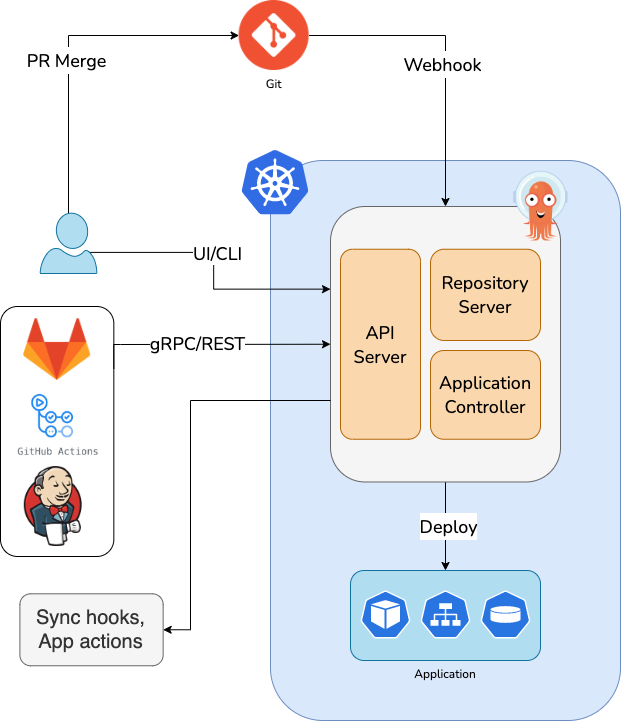

# Argo CD Playground

# What is Argo CD?

Argo CD is a declarative, GitOps continuous delivery tool for Kubernetes.



# Features

- Declarative tool for Continuous Delivery of the Kubernetes applications
- Control plane that extends GitOps for Infrastructure deployments
- Live State vs Desired Target State
- Scalability, Multi-tenancy, Security, Extensibility
- Extension of Kubernetes cluster

# Demo Environment

1. Install Argo CD via Helm Chart
2. Connect the Git Repo (https://github.com/HivemindTechnologies/argocd-playground)
3. Deploy the Application via Argo CD


# Install Argo CD via Helm Chart

1. Create Argo CD namespace and switch into it:

```yaml
kubectl create namespace argocd
```

1. Install Argo CD with Helm Chart:

```bash
helm repo add argo https://argoproj.github.io/argo-helm /
helm install argocd argo/argo-cd
```

# Configure the Git Repo

1. Open the Argo CD UI
2. Click on **Settings** → **Repositories**
3. Click on **Connect Repo** 
4. Fill the form with all the Git repo information and click on **Connect**

# Deploy the Application via Argo CD

1. Create the manifest file for the Argo CD application:

```yaml
apiVersion: argoproj.io/v1alpha1
kind: Application
metadata:
  name: cool-app
  namespace: argocd
spec:
  project: default
  source:
    path: cool-app
    repoURL: https://github.com/HivemindTechnologies/argocd-playground.git
    targetRevision: main
  destination:
    namespace: cool-app
    server: https://kubernetes.default.svc
  syncPolicy:
    automated:
      selfHeal: true
      prune: true
    syncOptions:
      - CreateNamespace=true
```

2. Deploy the application manifest in Kubernetes:

```yaml
kubectl apply -f cool-app.yaml -n argocd
```
